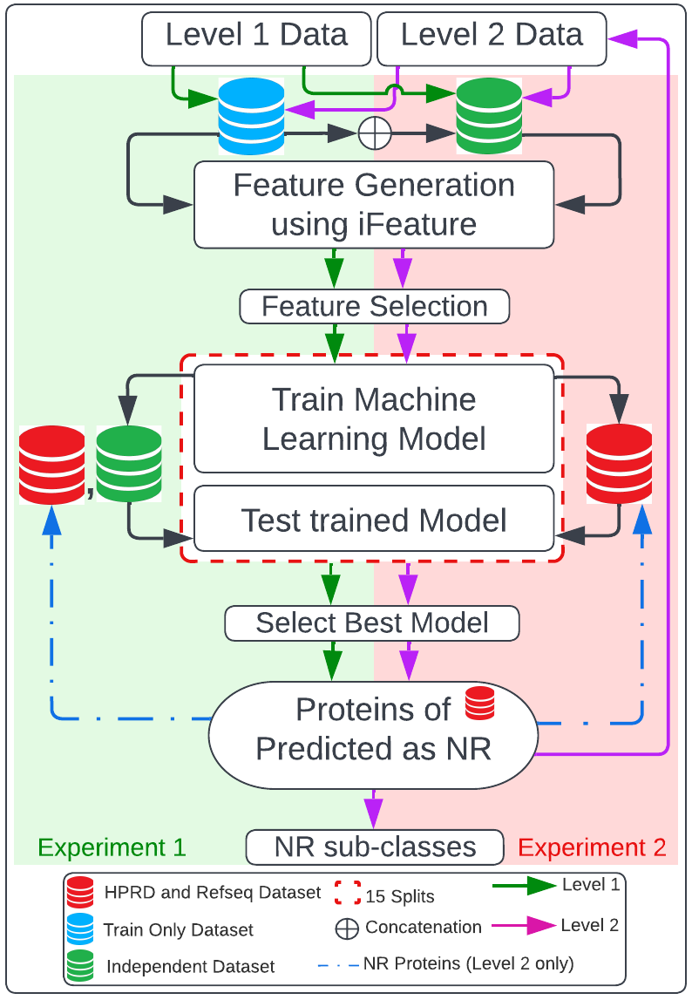

# NRPreTo (a two level NR protein clasification tool)
NRPreTo is a two level Nuclear Receptor (NR) protein subfamily classification tool in which the first level predicts whether a protein sequence is a NR or not and second level predicts the sub-class of the said NR proteins.Only true positive proteins predicted as NRs at level-1 are taken ahead for the second level prediction.Feature selection was done at both levels independently to select important descriptors from an initial 13,494 descriptors calculated using iFeature package.We also performed hyper-parameters tuning at each level to obtained best performing model. NRPreTo successfully predicted 59 novel NR from human proteome when tested on HRPD and Refseq datasets.



## Requirements

Following python libraries must be installed in the system in order to run NRPreTo:
1. Boruta 0.3
```bash
pip install Boruta
```
2. Hyperopt 0.2.7
```bash
pip install hyperopt
```
    
## How to run NRPreto

To run NRPreTo with default settings (feature selection = True and hyper parameters tuning = True) at both level, run the following command

```bash
  python3 main.py 
```
To run NRPreTo with no feature selection at both level, run the following command

```bash
  python3 main.py --feature_selection = 0
```

To run NRPreTo with no hyperparameter tuning at both level, run the following command

```bash
  python3 main.py --hyperparameter_tune = 0
```
To run NRPreTo with different combination of settings at both level, run the following command

```bash
  #for example if user wants to perform hyper-parameters tune but not feature selection, execute following line of code
  python3 main.py --feature_selection = 0 --hyperparameter_tune = 1
```
## Data Folder

We utilized two previously-published benchmark datasets, namely 
benchmark dataset 1 (BD1)[2] and benchmark dataset 2 (BD2) 
[1], which compose of training and independent datasets with 
both NR and Non-NR sequences.  Both benchmark datasets were prepared from the Nuclear Receptor 
Database (NucleaRDB Release5.0) containing 3016 NR sequences which 
are phylogenetically classified into seven subfamilies with each 
subfamily containing NR sequences from different animal species. 
The two benchmark datasets were prepared from this initial set by 
applying a cutoff of ≥40% and ≥60% similarity among sequences to 
generate BD1 and BD2, respectively.  The detailed procedure of 
generating the NR and Non-NR sequences of benchmark datasets can 
be found in previous studies [1][2]. We then tested trained model on
 the human proteome collected from two NCBI Refseq 
(humans) [4] and Human Protein Reference Database (HPRD).

We have provided following subsets of benchmark datasets to train NRPreTo and
external datasets to test NRPreTo. 

1. BD1 (train (100 samples) and independent (100 samples))
2. BD2 (train (84 samples) and independent (86 samples))
3. HPRD (81 samples)
4. Refseq Dataset (83 samples)


## How to generate descriptors using iFeature package

Feature generation was done using the standalone version of 
iFeature package as per the instructions described in the github 
repository at https://github.com/Superzchen/iFeature [3]. iFeature 
is an open source Python-based toolkit for generating a multitude 
of descriptors for protein and peptide sequences. For this study 
we calculated 13,494 descriptors which belong to seven descriptor 
groups. We downloaded iFeature package provided 
in their github repository locally and followed the instructions 
to calculate each of the seven descriptor group individually which 
were later concatenated resulting in 13,494 descriptors for each 
protein. This procedure was used to create features of the training, independent 
and external protein dataset.


## Script Description

#### main.py
This is a main script. User need to run this script to run NRPreTo. 

#### hyperparameter_tune.py
This scripts uses Hyperopt package in order to select best hyperparameters for RF model. User can edit 'Space' (line 13) dictionary in order to change hyperparameter range pool. User can also change scoring method (line 26) in order to change metrics to evaluate models with different hyperparameters.

#### feature_rank.py
This scripts uses Borutapy package in order to select important features for RF model. User can edit RF models hyperparameters (line 12) to be used for feature ranking.

#### utilities.py
This script is comprised of helper functions that are used to build the method.

#### model_eval.py
This script is used to evaluate model at 2 different levels. This scripts provides both confusion matrix and model performance in terms of F1, Accuracy, Presicion, Recall, ROC-AUC score and Mathews Correlation Coefficient.


## Run Locally

Clone the project

```bash
  git clone https://github.com/bozdaglab/NRPreTo
```

Install libraries

```bash
  pip install Boruta
  pip install hyperopt
```

Run NRPreTo

```bash
  python3 main.py 
```


## References
[1] Wang, P., Xiao, X. & Chou, K.-C. NR-2L: A Two-Level Predictor for Identifying Nuclear Receptor Subfamilies Based on Sequence-Derived Features. PLoS ONE 6, e23505 (2011).

[2] Ismail, H. D., Saigo, H. & Kc, D. B. RF-NR: Random Forest Based Approach for Improved Classification of Nuclear Receptors. IEEE/ACM Trans Comput Biol Bioinform 15, 1844–1852 (2018)

[3] Chen Z, Zhao P, Li F, Leier A, Marquez-Lago TT, Wang Y, Webb GI, Smith AI, Daly RJ*, Chou KC*, Song J*. iFeature: a python package and web server for features extraction and selection from protein and peptide sequences. Bioinformatics, 2018, Volume 34, Issue 14, 15 July 2018, Pages 2499–2502, doi: 10.1093/bioinformatics/bty140.

[4] O’Leary, N. A. et al. Reference sequence (RefSeq) database at NCBI: current status, taxonomic expansion, and functional annotation. Nucleic Acids Res 44, D733-745 (2016).
